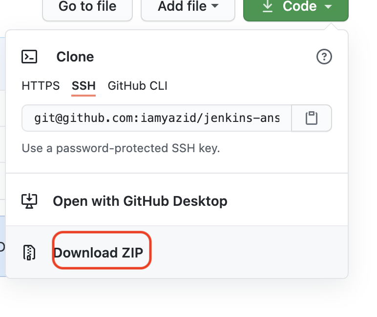
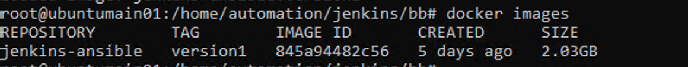
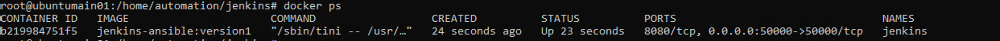

### Installing Jenkins Ansible

- download git repository and extract to your home directory.
<br>

- open terminal & change directory to your jenkins_ansible location

```console
cd ../jenkins_ansible
```

- spin the vm and ssh to server

```console
vagrant up
vagrant ssh
sudo -i
```

- become root and import docker jenkins (1st time setting only)

```console
sudo -i
docker load --input jenkins_ansible_version1.tar
docker images
```
<br>

- start the services

```console
cd /home/automation/jenkins
docker-compose up -d
docker ps
```
<br>

- login to http://127.0.0.1:8000 with username admin password Passw0rd
